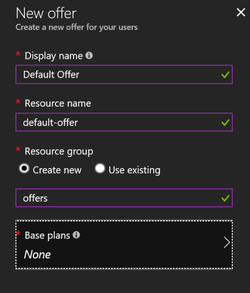
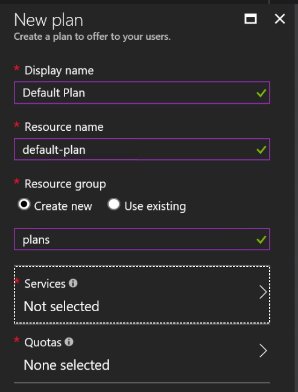
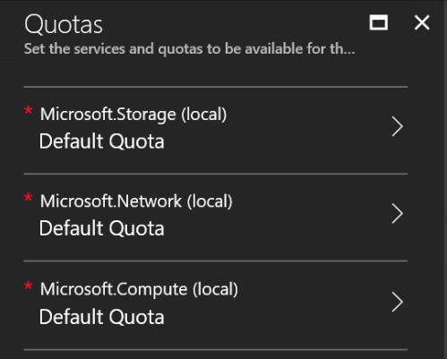
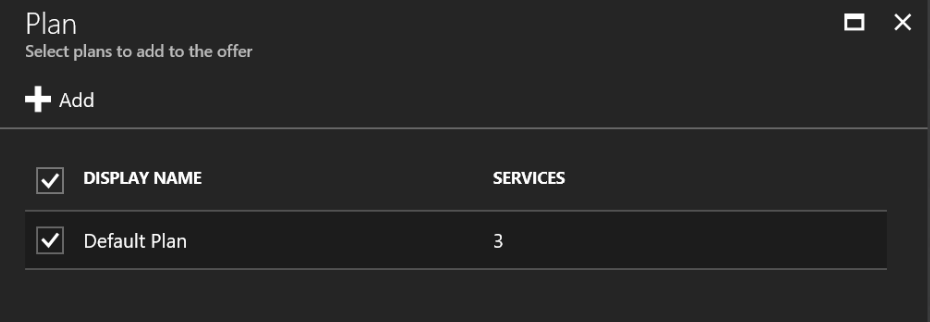
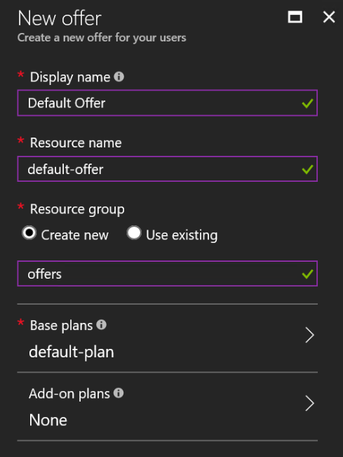

# Create the first user Subscription
Even as an Azure Stack Administrator, you're not able to deploy resources within the tenant portal. First of all we've to create a "user" subscription.

 * Goto your Azure Stack Admin Portal (https://adminportal.local.azurestack.external)

**Create an Offer**
1. Click on "More services" and "Offers"
2. Click on "Create Offers" or "+ Add"
3. Enter a Display Name, Resource Name and create a new Resource group "offers"

4. Click on "Base plans" to add a new Plan to your offer
5. In the "Plan" pane, click on "+ Add" to create a new plan
6. Select a "Display name", "Resource name" and create a new Resource group "plans"

7. Click on "Services" and select "Compute", "Network" and "Storage"
8. Click on "Quotas" and select the "Default Quota" for "Compute", "Network" and "Storage"

9. Click "OK"
10. Click "OK" in "New plan"
11. Select the newly created "Default Plan" and click "Select"

12. Click on "Create" to create your Default Offer

**Create a Subscription**
1. 
2. Click on "More services" and "User subscriptions"
3. In "User subscriptions" click on "+ Add" to create a new subscription
4. Create a "new user subscription" for your AzureAD account
5. in 
